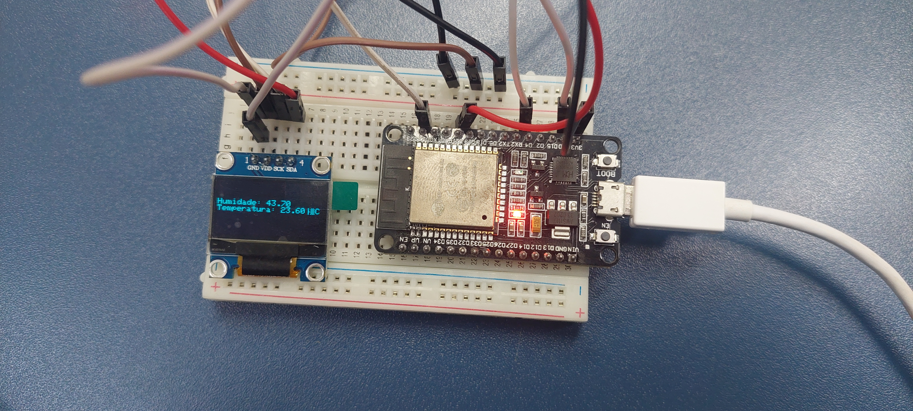
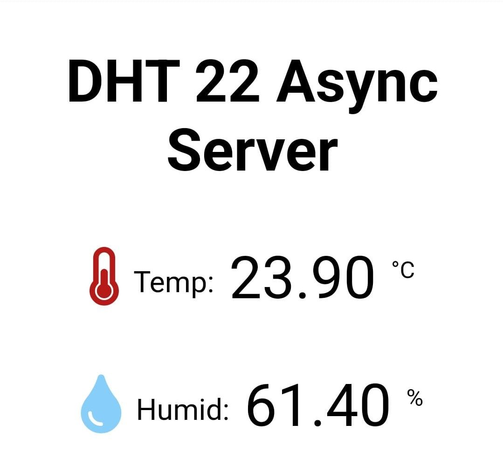

# ESP32-DHT-Sensor-OLED
A Simple display of temperature and humidity using a DHT22 Sensor and an Esp32 Dev Module.

Made using the Arduino IDE and C++, the project monitors the current temperature and Humidity of the room/ambient, it has an OLED display installed for easy to see information.
The Updated version has a Async Web Server that is easy to customize and setup, only requiring a network to connect to.
Next iterations will have a self hosting network for those who dont want to use it in conjunction with their main network.

Attention! The default IP for acess can change based on your network!

# ESP32 Pin Out and DHT22 Setup for Reference
For this project i am using Pin #4 (D4/GPIO4)

 

 

 

 

